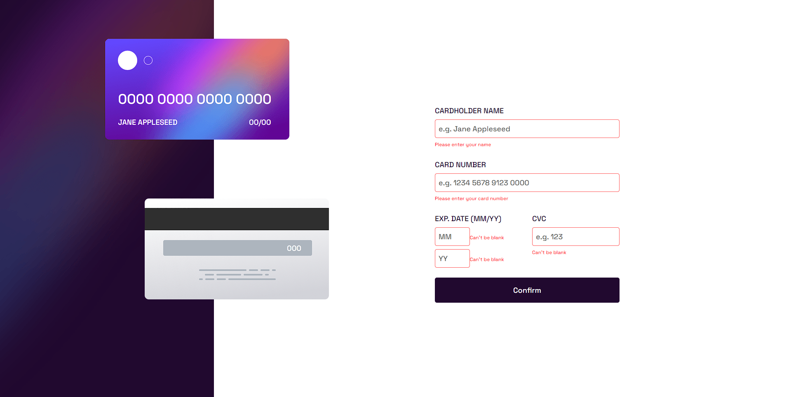
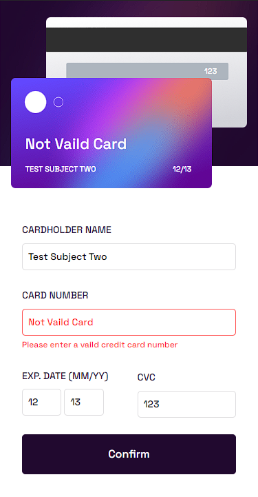

# Frontend Mentor - Interactive card details form solution

This is a solution to the [Interactive card details form challenge on Frontend Mentor](https://www.frontendmentor.io/challenges/interactive-card-details-form-XpS8cKZDWw). Frontend Mentor challenges help you improve your coding skills by building realistic projects. 

## Table of contents

- [Overview](#overview)
  - [The challenge](#the-challenge)
  - [Screenshot](#screenshot)
  - [Links](#links)
- [My process](#my-process)
  - [Built with](#built-with)
  - [What I learned](#what-i-learned)
  - [Continued development](#continued-development)
  - [Useful resources](#useful-resources)
- [Author](#author)

## Overview

### The challenge

Users should be able to:

- Fill in the form and see the card details update in real-time
- Receive error messages when the form is submitted if:
  - Any input field is empty
  - The card number, expiry date, or CVC fields are in the wrong format
- View the optimal layout depending on their device's screen size
- See hover, active, and focus states for interactive elements on the page

### Screenshot

### Links

- Solution URL: [Add solution URL here](https://github.com/000xzhou/interactive-card-details-form)
- Live Site URL: [Add live site URL here](https://000xzhou.github.io/interactive-card-details-form/)

## My process
I build the form with grid. I notice that the form looks the same in both the desktop and mobile version.
I only use flex on the date on the card image.
I use % instead of rem/em/px for most of the layout because most of it is in position absolute, I want the placement to be the same no matter what size so I don't have to rewrite for mobile and desktop.

I want to try some libaray for vaildtion and found jQuery Validation Plugin. It was very easy to use but I did run into a problem.
The problem is that when the form submit. It defaults to submit because of form.submit(). Without it the button won't do anything. 

At first I want to send into a different html file for the thank you page. Then I got side track it and mess with the server(in branch), so I just made it all into one big file.

One night my brain just started on it's own and was though about the soultions I can try to solve the submit problem. I wrote it down and went to sleep and now it's fix.

### Built with

- Semantic HTML5 markup
- CSS custom properties
- Flexbox
- CSS Grid
- jQuery Validation Plugin

### What I learned

When stuck take a break, work on another project, learn something else, take a nap and one day magic will happen.
Because staring at a screen with no new input don't help at all.

### Continued development

I still want to improve on this project. Like how when you type in the card number. The number on the card don't space out. I know some javascript will fix it. I will come back to it later.
I want to work on accessibility since that's a big part of front end.
And I feel like my css needs work. I know there was better ways to move things around.

### Useful resources

- [jquery validation examples](https://html.form.guide/jquery/validation-using-jquery-examples/) - This is how I found out about the puglin.
- [jquery validation documents](https://jqueryvalidation.org/documentation/) - This is the documentation of how to use the libaray. I use it for stuff that isn't in the above link.

## Author

- Website - [XZ](https://www.your-site.com)
- Frontend Mentor - [@000xzhou](https://www.frontendmentor.io/profile/000xzhou)

